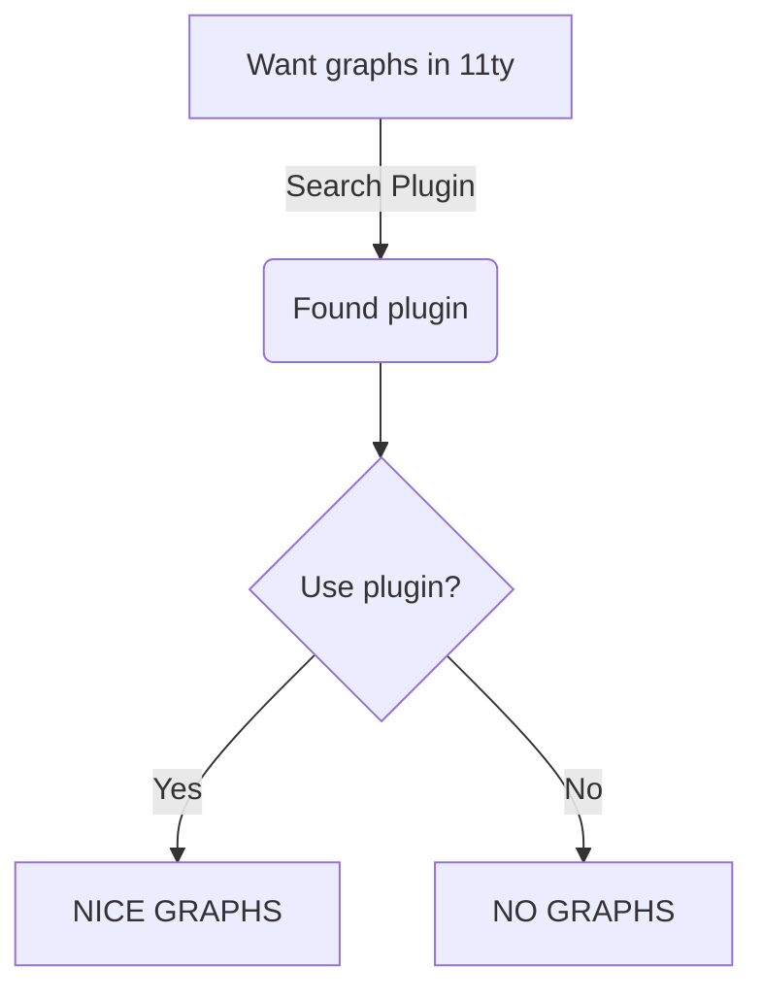

Welcome to the Documentation Style Guide! This document serves as a comprehensive reference for all the formatting options available in **Markdown**. You can use it as a template to see how various elements are rendered and to ensure consistency in your own documentation.

---

## Headers

Headers are essential for structuring your document. Markdown provides six levels of headers.

## H2 Header (A major section)
### H3 Header (A sub-section)
#### H4 Header (Further sub-division)
##### H5 Header (Used for fine-grained organization)
###### H6 Header (The smallest header)


---

## Paragraphs and Basic Text Formatting

This is a standard paragraph. You can create a new paragraph by leaving a blank line. This paragraph contains **bold text** and *italic text*. You can also use ***bold and italic text together***. Strikethrough text is also supported.

You can also create a new line within a paragraph using two spaces at the end of the line.  
Like this.

> This is a blockquote. It's often used for quoting a passage from another source or for emphasizing a particular point.
> You can have multiple paragraphs within a blockquote.
>
> > This is a nested blockquote.
> > It's useful for quoting a quote!

---

## Lists

Lists are great for organizing information. There are ordered lists, unordered lists, and even nested lists.

### Unordered Lists

* Item one
* Item two
    * A nested item
    * Another nested item
* Item three

### Ordered Lists

1.  First item
2.  Second item
3.  Third item
    1.  A nested ordered item
    2.  Another nested ordered item
4.  Fourth item

---

## Code

Code blocks are crucial for technical documentation. Markdown supports both inline code and multi-line code blocks.

### Inline Code

Use backticks to show `inline code`. This is great for mentioning a variable name like `my_variable` or a function `my_function()`.

### Code Blocks

You can create a code block using three backticks. You can also specify the language for syntax highlighting.

```python
def hello_world():
  print("Hello, world!")

# Call the function
hello_world()
```

## Tables

Tables are useful for presenting data in a structured format.

These tables are made responsive at small sizes through table-saw, which is injected by 11ty transform as a final build step.


|Header 1|Header 2|Header 3|
|---|---|---|
|Row 1, Col 1|Row 1, Col 2|Row 1, Col 3|
|Row 2, Col 1|Row 2, Col 2|Row 2, Col 3|
|Row 3, Col 1|Row 3, Col 2|Row 3, Col 3|

```md
|Header 1|Header 2|Header 3|
|---|---|---|
|Row 1, Col 1|Row 1, Col 2|Row 1, Col 3|
|Row 2, Col 1|Row 2, Col 2|Row 2, Col 3|
|Row 3, Col 1|Row 3, Col 2|Row 3, Col 3|
```

You can align columns by using colons (`:`) in the separator line.

|Left-Aligned|Center-Aligned|Right-Aligned|
|:---|:---:|---:|
|Left|Center|Right|
|Aligned|Aligned|Aligned|

mardown of the table above 

```md
|Left-Aligned|Center-Aligned|Right-Aligned|
|:---|:---:|---:|
|Left|Center|Right|
|Aligned|Aligned|Aligned|
```


## Links and Images

Links and images are essential for connecting to other resources and adding visual context.

### Links

This is a [link to Google](https://www.google.com). You can also use reference-style links, which can make your markdown cleaner for multiple links to the same URL.

Here's an example: [Google Home Page](https://www.google.com).

### Images

You can embed images in your documentation. They use similar syntax to links but with an exclamation mark at the beginning.

These images are automatically optimized by using 11ty img plugin


## Video Embeds (Youtube and Vimeo)

There is a dedicated component for embedding YouTube and Vimeo videos.

They are powered by:
* https://github.com/paulirish/lite-youtube-embed
* https://github.com/luwes/lite-vimeo-embed



---



They are rendered using a bookshop snippet. `\` has been added to the liquid tags to prevent the liquid from being interpreted.

```liquid
\{\% bookshop 'snippets/videoEmbed' platform: "youtube" videoId: "tKrJTc2DgbY" \%\}


\{\% bookshop 'snippets/videoEmbed' platform: "vimeo" videoId: "1025941874" \%\}
```

---

## Horizontal Rules

A horizontal rule is a line that separates content. It's great for visually breaking up sections.

---

You can create a horizontal rule using three or more hyphens (`---`), asterisks (`***`), or underscores (`___`). All three will produce the same result.

---
## Mermaid support



---

## Task Lists

Task lists (or checkboxes) are a great way to track to-do items.

- [x] This is a completed task.
    
- [ ] This is an incomplete task.
    
- [ ] Another incomplete task.
    

---

## Escaping Characters

Sometimes you need to display a character that Markdown would normally format, like an asterisk or a hashtag. You can use a backslash to escape it.

\*This text is not italic.\* \#This is not a header.

---

## Out of the box markdown containers

Markdown-it container plugin is installed. 

https://www.npmjs.com/package/markdown-it-container

The following containers come defined and styled out of the box

Either `:::` or `|||` can be used to create a container. If you are trying to place a container inside of a tabs you need to use the `|||` syntax.

Nesting can be done by increasing the marker of the outer container

||| info
**Information**

This is a standard informational message. It uses the primary accent color.
|||

::: warning
**Warning**

You should pay attention to this. It's not critical, but it's important.
:::

||| error
**Error!**

Something went wrong. This requires immediate attention.
|||

|||| info
**Information**

This is a standard informational message. It uses the primary accent color.
||| warning
**Warning**

You should pay attention to this. It's not critical, but it's important.
|||
||||

```md
||| info
**Information**

This is a standard informational message. It uses the primary accent color.
|||

::: warning
**Warning**

You should pay attention to this. It's not critical, but it's important.
:::

||| error
**Error!**

Something went wrong. This requires immediate attention.
|||

|||| info
**Information**

This is a standard informational message. It uses the primary accent color.
||| warning
**Warning**

You should pay attention to this. It's not critical, but it's important.
|||
||||
```

---

## Mardown Tabs
This is possible through markdown it tab plugin. Out of the box only a `tabs` container is configured, styled, and has the js to make it work.

https://www.npmjs.com/package/@mdit/plugin-tab

::: tabs#fruit

@tab:active Apple#apple
This is a tab about **apples**

@tab Banana#banana
This is a tab about **bananas**

@tab Oranges#orange
This is a tab about **oranges**
:::


```md
::: tabs#fruit

@tab:active Apple#apple
This is a tab about **apples**

@tab Banana#banana
This is a tab about **bananas**

@tab Oranges#orange
This is a tab about **oranges**
:::
```
----
## Accordion
These acordions are possible through markdown-it-collapsible plugin:
https://www.npmjs.com/package/markdown-it-collapsible

The the default rendering of this plugin has been modified for styling purposes and nested accordion support.

Accordions can be opened by default by using `++>` instead of the standard `+++` Nesting accordions is done by adding an extra `+` in the beginning of the nested accordion.

Other components, such as tabs, can also be nested.

---

++> What is the purpose of an accordion?
Accordions help organize content into collapsible sections. This allows users to scan topics quickly and expand only the information they need, reducing clutter and improving readability.
++>

+++ How do you create a "Prerequisites" section for a tutorial?
Before you begin, make sure you have the following installed:

* **Node.js**: Version 18 or higher.
* **Git**: For version control.
* **A code editor**: We recommend VS Code.
+++

+++ Can I nest accordions?
Yes, you can nest accordions to create hierarchical collapsible sections. For every nested accordion level you need to add an extra `+` in the beginning of the markdown.

++++ Inner Accordion: API Parameters

id (string, required): The unique identifier for the user.

email (string, optional): The user's email address.

++++
+++

```md
++> What is the purpose of an accordion?
Accordions help organize content into collapsible sections. This allows users to scan topics quickly and expand only the information they need, reducing clutter and improving readability.
++>

+++ How do you create a "Prerequisites" section for a tutorial?
Before you begin, make sure you have the following installed:

* **Node.js**: Version 18 or higher.
* **Git**: For version control.
* **A code editor**: We recommend VS Code.
+++

+++ Can I nest accordions?
Yes, you can nest accordions to create hierarchical collapsible sections. For every nested accordion level you need to add an extra `+` in the beginning of the markdown.

++++ Inner Accordion: API Parameters

id (string, required): The unique identifier for the user.

email (string, optional): The user's email address.

++++
+++
```
----
## File Tree
This template comes with markdown-it-ultree installed to generate file trees that can be collapesed. The tree has been styled to match your theme.
* https://www.npmjs.com/package/markdown-it-ultree


Checkout out this example tree!

||| info
**Note**

This isn't the actual tree structure of this project. It's just a demo of the plugin.
|||

```ultree
. Eleventy Project Structure
  src
    _data
      site.json
      theme.json
    _includes
      layouts
        base.liquid
        doc.liquid
      partials
        footer.liquid
        sidebar.liquid
    assets
      css
        main.scss
      images
        logo.svg
      js
        theme-toggle.js
    docs
      collection-one
        page-a.md
        page-b.md
      collection-two
        index.md
    index.md
  _site
    (Output Directory)
  .eleventy.js
  package.json
```
```md
\```ultree
. Eleventy Project Structure
  src
    _data
      site.json
      theme.json
    _includes
      layouts
        base.liquid
        doc.liquid
      partials
        footer.liquid
        sidebar.liquid
    assets
      css
        main.scss
      images
        logo.svg
      js
        theme-toggle.js
    docs
      collection-one
        page-a.md
        page-b.md
      collection-two
        index.md
    index.md
  _site
    (Output Directory)
  .eleventy.js
  package.json
\```
```
---
## Bracketed spans

This template comes with the following markdown-it plugins installed
* https://www.npmjs.com/package/markdown-it-bracketed-spans
* https://www.npmjs.com/package/markdown-it-attrs

The styles below come out of the box.

---

To save the file, press [Ctrl]{.kbd} + [S]{.kbd}.

To open the command palette, use [Ctrl]{.kbd} + [Shift]{.kbd} + [P]{.kbd}.

Project status: [Completed]{.label .green}

Document version: [v2.1 (In Review)]{.label .orange}

Action required: [Approval Needed]{.label .red}

Category: [Marketing Collateral]{.label .blue}

```md
To save the file, press [Ctrl]{.kbd} + [S]{.kbd}.

To open the command palette, use [Ctrl]{.kbd} + [Shift]{.kbd} + [P]{.kbd}.

Project status: [Completed]{.label .green}

Document version: [v2.1 (In Review)]{.label .orange}

Action required: [Approval Needed]{.label .red}

Category: [Marketing Collateral]{.label .blue}
```

---

---

## Conclusion

This concludes the Markdown Style Guide. By using these elements, you can create rich, well-structured, and easy-to-read documentation.