Mermaid is a powerful diagramming tool that lets you create diagrams and visualizations using text-based definitions. This page showcases all the diagram types available in Mermaid with practical examples.

---

## Flowcharts

Flowcharts are the most common diagram type. They show processes and decision points.

### Basic Flowchart

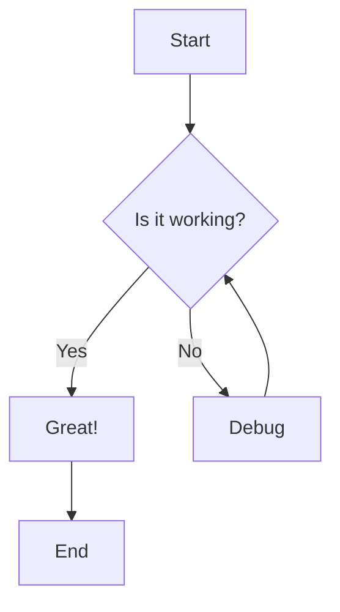
```mermaid
graph TD
    A[Start] --> B{Is it working?}
    B -->|Yes| C[Great!]
    B -->|No| D[Debug]
    D --> B
    C --> E[End]
```

### Flowchart with Different Shapes

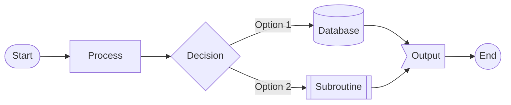
```mermaid
graph LR
    A([Start]) --> B[Process]
    B --> C{Decision}
    C -->|Option 1| D[(Database)]
    C -->|Option 2| E[[Subroutine]]
    D --> F>Output]
    E --> F
    F --> G((End))
```

### Flowchart with Subgraphs

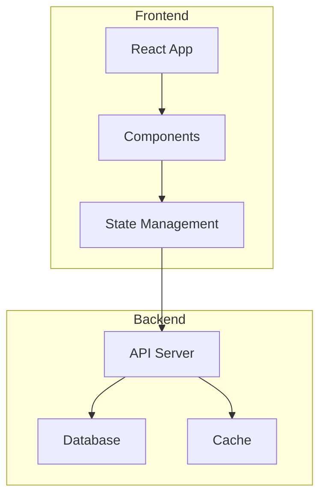
```mermaid
graph TB
    subgraph Frontend
        A[React App] --> B[Components]
        B --> C[State Management]
    end
    subgraph Backend
        D[API Server] --> E[Database]
        D --> F[Cache]
    end
    C --> D
```

---

## Sequence Diagrams

Sequence diagrams show interactions between different actors or systems over time.

### Basic Sequence Diagram

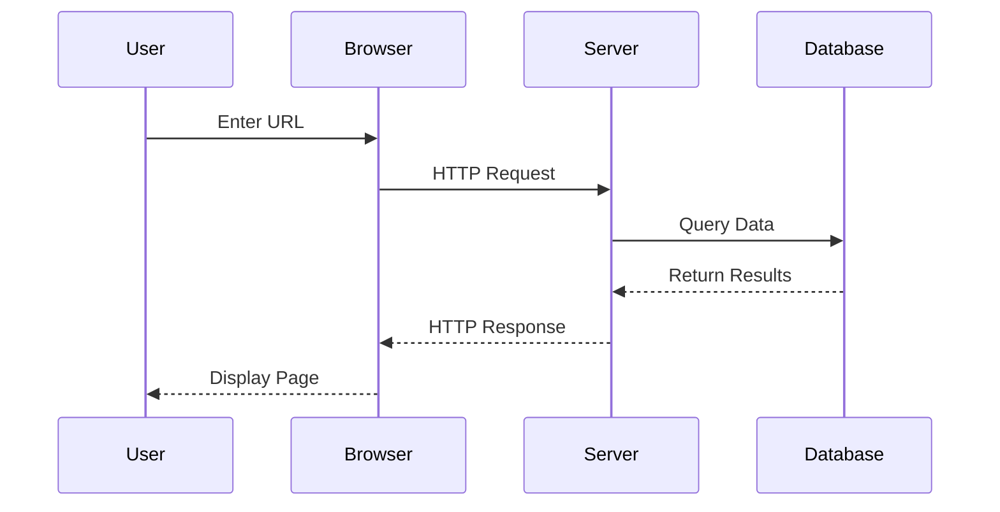
```mermaid
sequenceDiagram
    participant User
    participant Browser
    participant Server
    participant Database

    User->>Browser: Enter URL
    Browser->>Server: HTTP Request
    Server->>Database: Query Data
    Database-->>Server: Return Results
    Server-->>Browser: HTTP Response
    Browser-->>User: Display Page
```

### Sequence Diagram with Loops and Notes

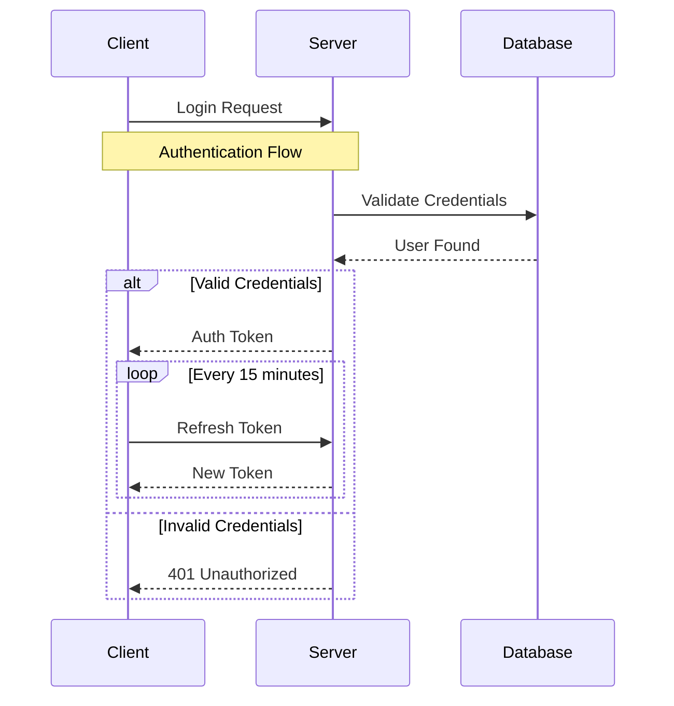
```mermaid
sequenceDiagram
    participant C as Client
    participant S as Server
    participant D as Database

    C->>S: Login Request
    Note over C,S: Authentication Flow

    S->>D: Validate Credentials
    D-->>S: User Found

    alt Valid Credentials
        S-->>C: Auth Token
        loop Every 15 minutes
            C->>S: Refresh Token
            S-->>C: New Token
        end
    else Invalid Credentials
        S-->>C: 401 Unauthorized
    end
```

---

## Class Diagrams

Class diagrams are useful for showing object-oriented structures.

### Basic Class Diagram

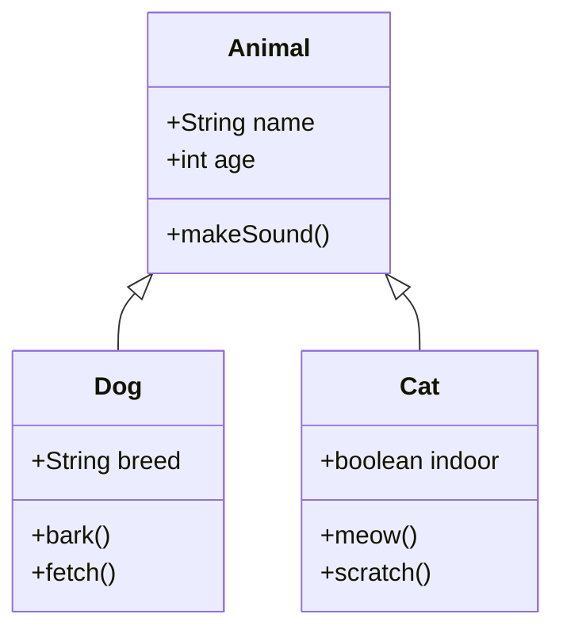
```mermaid
classDiagram
    class Animal {
        +String name
        +int age
        +makeSound()
    }

    class Dog {
        +String breed
        +bark()
        +fetch()
    }

    class Cat {
        +boolean indoor
        +meow()
        +scratch()
    }

    Animal <|-- Dog
    Animal <|-- Cat
```

### Class Diagram with Relationships

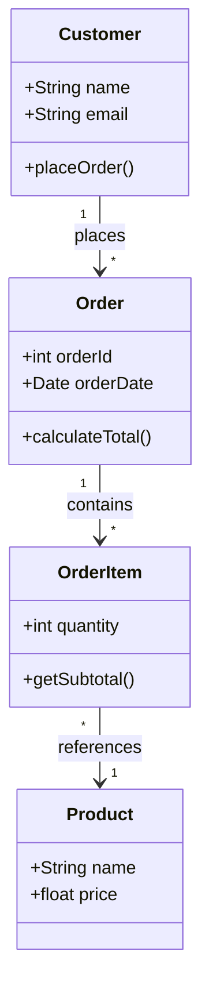
```mermaid
classDiagram
    class Order {
        +int orderId
        +Date orderDate
        +calculateTotal()
    }

    class Customer {
        +String name
        +String email
        +placeOrder()
    }

    class Product {
        +String name
        +float price
    }

    class OrderItem {
        +int quantity
        +getSubtotal()
    }

    Customer "1" --> "*" Order : places
    Order "1" --> "*" OrderItem : contains
    OrderItem "*" --> "1" Product : references
```

---

## State Diagrams

State diagrams show the different states an object can be in and transitions between them.

### Basic State Diagram

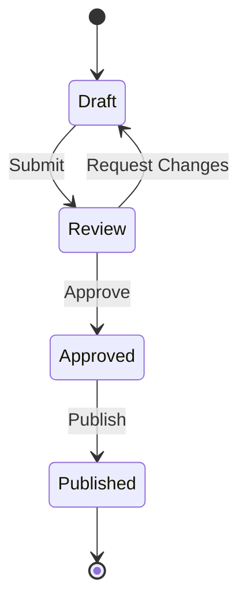
```mermaid
stateDiagram-v2
    [*] --> Draft
    Draft --> Review : Submit
    Review --> Draft : Request Changes
    Review --> Approved : Approve
    Approved --> Published : Publish
    Published --> [*]
```

### State Diagram with Composite States

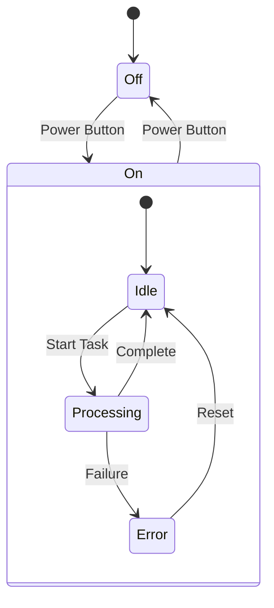
```mermaid
stateDiagram-v2
    [*] --> Off
    Off --> On : Power Button

    state On {
        [*] --> Idle
        Idle --> Processing : Start Task
        Processing --> Idle : Complete
        Processing --> Error : Failure
        Error --> Idle : Reset
    }

    On --> Off : Power Button
```

---

## Entity Relationship Diagrams

ER diagrams show database relationships and structures.

### Basic ER Diagram

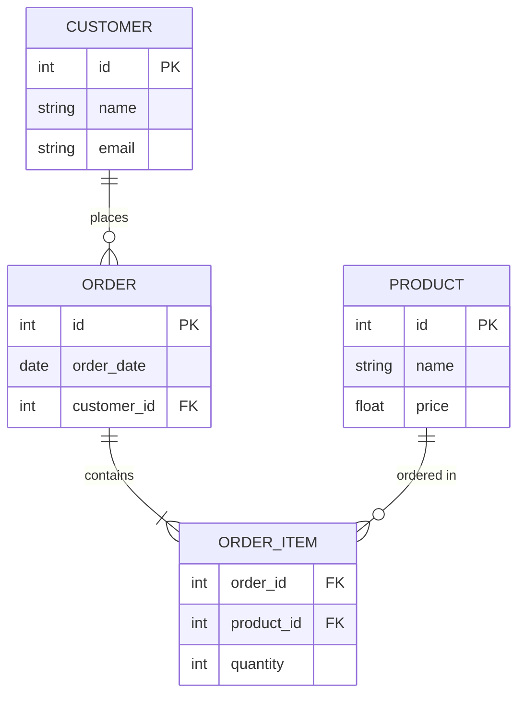
```mermaid
erDiagram
    CUSTOMER ||--o{ ORDER : places
    ORDER ||--|{ ORDER_ITEM : contains
    PRODUCT ||--o{ ORDER_ITEM : "ordered in"

    CUSTOMER {
        int id PK
        string name
        string email
    }

    ORDER {
        int id PK
        date order_date
        int customer_id FK
    }

    PRODUCT {
        int id PK
        string name
        float price
    }

    ORDER_ITEM {
        int order_id FK
        int product_id FK
        int quantity
    }
```

---

## Gantt Charts

Gantt charts are useful for project planning and timelines.

### Project Timeline

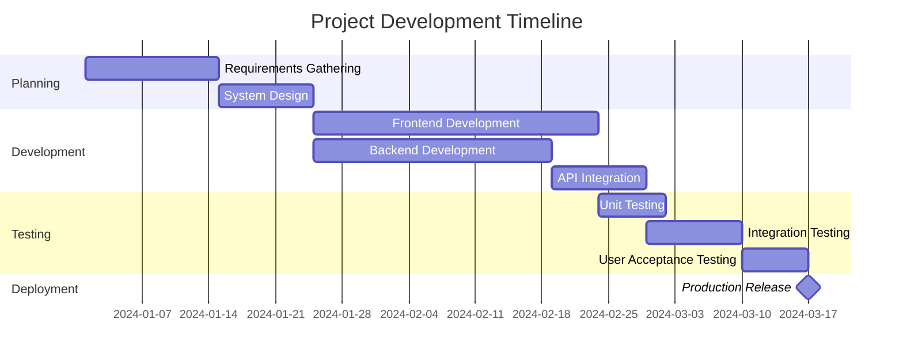
```mermaid
gantt
    title Project Development Timeline
    dateFormat YYYY-MM-DD

    section Planning
    Requirements Gathering    :a1, 2024-01-01, 14d
    System Design            :a2, after a1, 10d

    section Development
    Frontend Development     :b1, after a2, 30d
    Backend Development      :b2, after a2, 25d
    API Integration          :b3, after b2, 10d

    section Testing
    Unit Testing             :c1, after b1, 7d
    Integration Testing      :c2, after b3, 10d
    User Acceptance Testing  :c3, after c2, 7d

    section Deployment
    Production Release       :milestone, after c3, 0d
```

---

## Pie Charts

Pie charts display proportional data.

### Distribution Chart

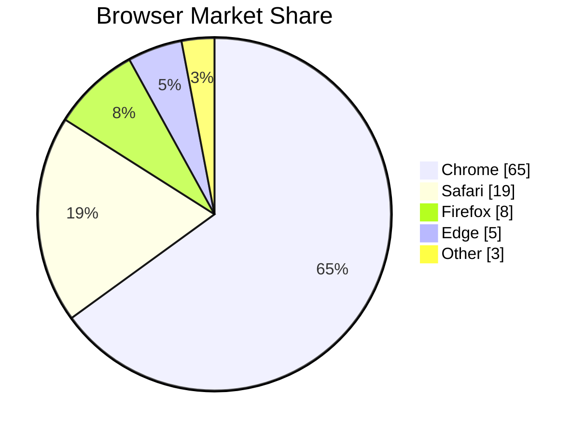
```mermaid
pie showData
    title Browser Market Share
    "Chrome" : 65
    "Safari" : 19
    "Firefox" : 8
    "Edge" : 5
    "Other" : 3
```

---

## Git Graphs

Git graphs visualize branch and merge history.

### Branch History

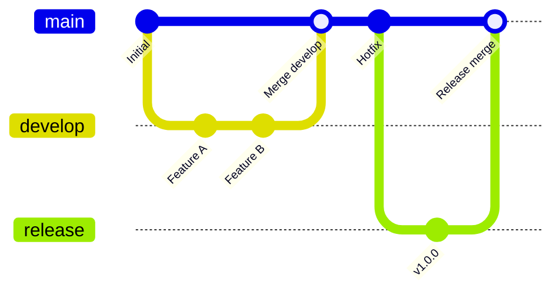
```mermaid
gitGraph
    commit id: "Initial"
    branch develop
    checkout develop
    commit id: "Feature A"
    commit id: "Feature B"
    checkout main
    merge develop id: "Merge develop"
    commit id: "Hotfix"
    branch release
    checkout release
    commit id: "v1.0.0"
    checkout main
    merge release id: "Release merge"
```

---

## Timeline Diagrams

Timeline diagrams show events in chronological order.

### Historical Timeline

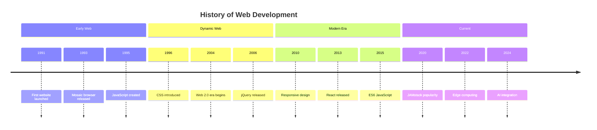
```mermaid
timeline
    title History of Web Development
    section Early Web
        1991 : First website launched
        1993 : Mosaic browser released
        1995 : JavaScript created
    section Dynamic Web
        1996 : CSS introduced
        2004 : Web 2.0 era begins
        2006 : jQuery released
    section Modern Era
        2010 : Responsive design
        2013 : React released
        2015 : ES6 JavaScript
    section Current
        2020 : JAMstack popularity
        2022 : Edge computing
        2024 : AI integration
```

---

## Quadrant Charts

Quadrant charts help categorize items along two dimensions.

### Priority Matrix

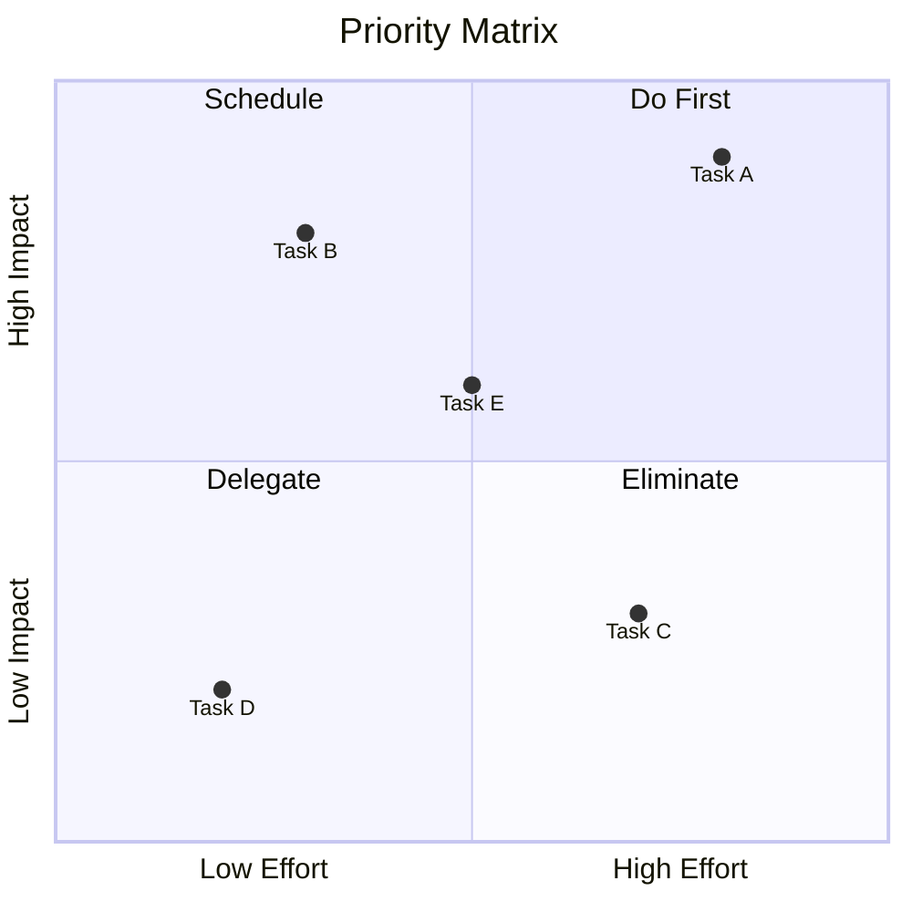
```mermaid
quadrantChart
    title Priority Matrix
    x-axis Low Effort --> High Effort
    y-axis Low Impact --> High Impact
    quadrant-1 Do First
    quadrant-2 Schedule
    quadrant-3 Delegate
    quadrant-4 Eliminate

    Task A: [0.8, 0.9]
    Task B: [0.3, 0.8]
    Task C: [0.7, 0.3]
    Task D: [0.2, 0.2]
    Task E: [0.5, 0.6]
```

---

## User Journey Diagrams

User journey diagrams map out user experiences.

### Customer Experience

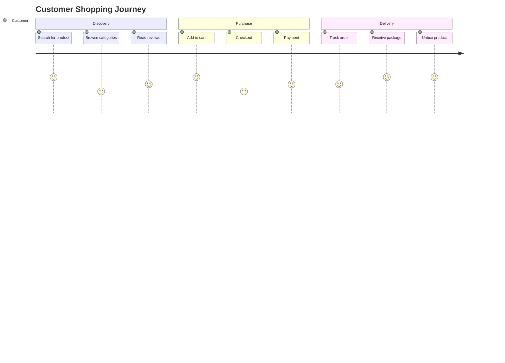
```mermaid
journey
    title Customer Shopping Journey
    section Discovery
        Search for product: 5: Customer
        Browse categories: 3: Customer
        Read reviews: 4: Customer
    section Purchase
        Add to cart: 5: Customer
        Checkout: 3: Customer
        Payment: 4: Customer
    section Delivery
        Track order: 4: Customer
        Receive package: 5: Customer
        Unbox product: 5: Customer
```

---

## Block Diagrams

Block diagrams show system components and their relationships.

### System Architecture

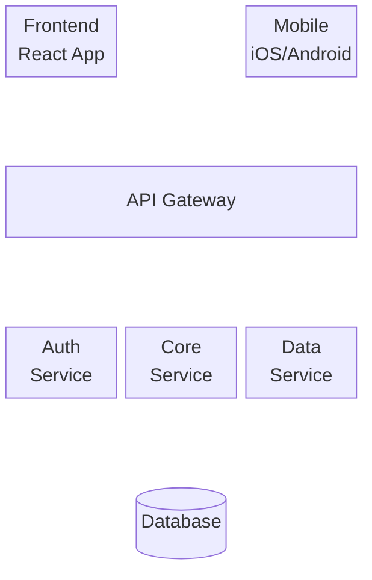
```mermaid
block-beta
    columns 3

    Frontend["Frontend\nReact App"]:1
    space:1
    Mobile["Mobile\niOS/Android"]:1

    space:3

    API["API Gateway"]:3

    space:3

    Auth["Auth\nService"]:1
    Core["Core\nService"]:1
    Data["Data\nService"]:1

    space:3

    DB[("Database")]:3
```

---

## Sankey Diagrams

Sankey diagrams show flow quantities between nodes.

### Energy Flow

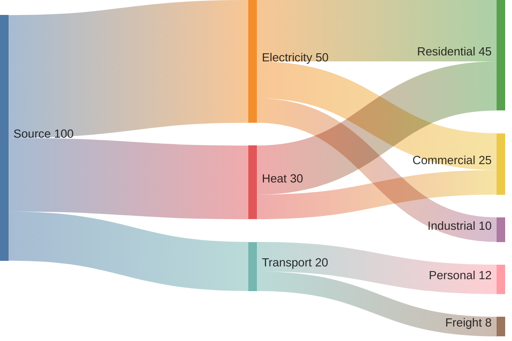
```mermaid
sankey-beta

Source,Electricity,50
Source,Heat,30
Source,Transport,20
Electricity,Residential,25
Electricity,Commercial,15
Electricity,Industrial,10
Heat,Residential,20
Heat,Commercial,10
Transport,Personal,12
Transport,Freight,8
```

---

## XY Charts

XY charts display data on a coordinate system.

### Sales Data

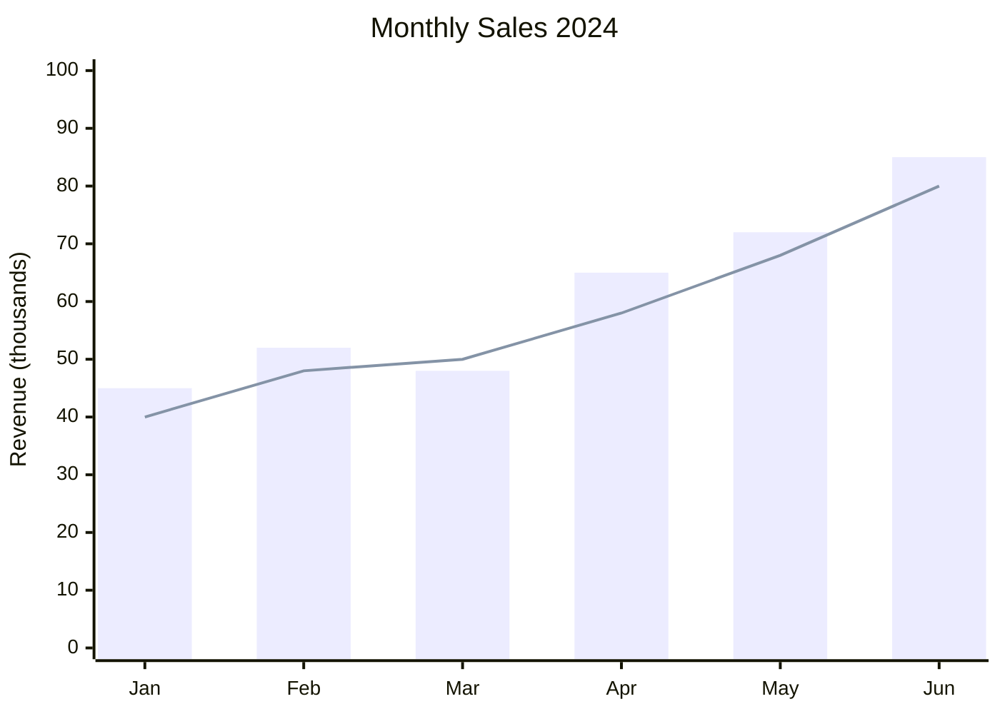
```mermaid
xychart-beta
    title "Monthly Sales 2024"
    x-axis [Jan, Feb, Mar, Apr, May, Jun]
    y-axis "Revenue (thousands)" 0 --> 100
    bar [45, 52, 48, 65, 72, 85]
    line [40, 48, 50, 58, 68, 80]
```

---

## Tips for Writing Mermaid Diagrams

1. **Keep it simple** - Start with basic diagrams and add complexity as needed
2. **Use meaningful labels** - Clear names make diagrams easier to understand
3. **Consistent styling** - Use similar shapes and patterns throughout
4. **Test incrementally** - Build diagrams piece by piece to catch syntax errors
5. **Add comments** - Use `%%` to add comments in your diagram code

### Example with Comments

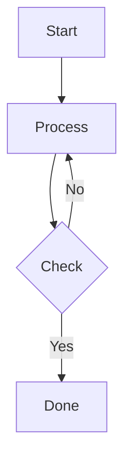
```mermaid
graph TD
    %% This is a comment
    A[Start] --> B[Process]
    %% Decision point
    B --> C{Check}
    C -->|Yes| D[Done]
    C -->|No| B
```

---

## Conclusion

Mermaid provides a powerful way to create diagrams directly in your documentation using simple text syntax. The diagrams automatically adapt to your site's theme, making them perfect for technical documentation, project planning, and system design.

For more information, visit the [official Mermaid documentation](https://mermaid.js.org/).
